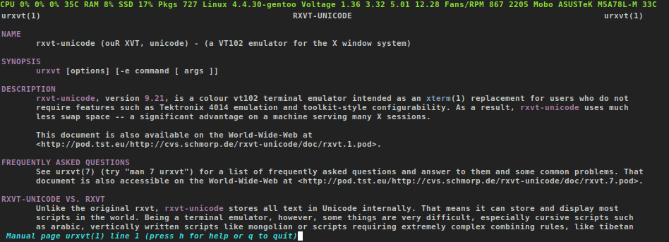
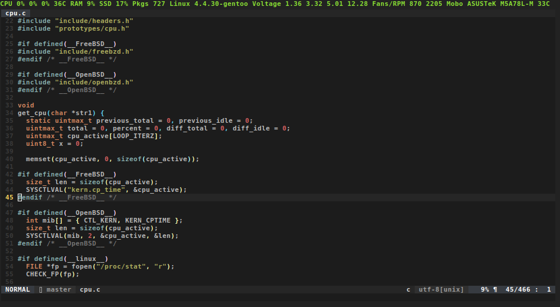

Status line for urxvt (rxvt-unicode) based on tabbed and tabbedex.

The sole purpose of this extension is to make it easy for you to keep track of things that you are interested to monitor while hacking your way something in the terminal.

Shoutout to the tabbed authors, and the tabbedex fork.





The status line input is generated by [pinky-bar](https://notabug.org/void0/pinky-bar).

# Installation

Simply place it in **/usr/lib/urxvt/perl/** for
system-wide availability or in **~/.urxvt/ext/** for user-only availability.
You can also put it in a folder of your choice, but then you have to add this
line to your **.Xdefaults/.Xresources**:

```bash
# Don't type ~ or $HOME
URxvt.perl-lib: /home/user/your/folder/

# Make sure to remove tabbed and/or tabbedex
# from the used extensions
URxvt.perl-ext-common: pinky

# Those colours are defined by you

# 0, 2 refer to:
*.color0: #222222
*.color2: #8ae234

URxvt.pinky.pinky-fg: 2
URxvt.pinky.pinky-bg: 0
```

# Usage

Use your favourite 'echo, print, printf' command to update the status line.

```bash
while true; do
  printf '\033]777;pinky;update_line;%s\007' 'Hello World'
  sleep 5
done &  # <-- "daemon mode"
```

# Requirements

* urxvt (rxvt-unicode) compiled with support for perl
